# MetaWallet System Architecture

```mermaid
flowchart TD
    %% ----------------------------------------------------------------
    %% USER GROUPS
    %% ----------------------------------------------------------------
    subgraph Users["User Groups"]
        Depositor["Depositor\n(WHITELISTED_ROLE)"]
        Manager["Manager\n(MANAGER_ROLE)"]
        Admin["Admin\n(ADMIN_ROLE)"]
        EmergencyAdmin["Emergency Admin\n(EMERGENCY_ADMIN_ROLE)"]
    end

    %% ----------------------------------------------------------------
    %% CORE CONTRACTS
    %% ----------------------------------------------------------------
    subgraph Core["Core Contracts"]
        MetaWallet["MetaWallet\n(MinimalSmartAccount + HookExecution + MultiFacetProxy)"]
        HookExecution["HookExecution\n(abstract, hook registry + chain executor)"]
        VaultModule["VaultModule\n(facet: ERC-7540 + ERC-20 + accounting)"]
    end

    MetaWallet -->|"inherits"| HookExecution

    %% MultiFacetProxy delegatecall routing
    MetaWallet -->|"delegatecall via MultiFacetProxy"| VaultModule

    %% ----------------------------------------------------------------
    %% HOOK CONTRACTS
    %% ----------------------------------------------------------------
    subgraph Hooks["Hook Contracts"]
        DepositHook["ERC4626ApproveAndDepositHook\n(approve + deposit into ERC-4626)"]
        RedeemHook["ERC4626RedeemHook\n(redeem shares from ERC-4626)"]
        SwapHook["OneInchSwapHook\n(approve + swap via 1inch)"]
    end

    %% ----------------------------------------------------------------
    %% EXTERNAL SYSTEMS
    %% ----------------------------------------------------------------
    subgraph External["External Systems"]
        ERC4626Vaults["External ERC-4626 Vaults\n(yield strategies)"]
        OneInchRouter["1inch Aggregation Router"]
        Registry["Registry\n(call authorization)"]
    end

    %% ----------------------------------------------------------------
    %% TOKEN LAYERS
    %% ----------------------------------------------------------------
    subgraph Tokens["Token Layers"]
        USDC["Underlying Asset\n(e.g. USDC)"]
        Shares["Vault Shares\n(mUSDC)"]
    end

    %% ================================================================
    %% DEPOSIT FLOW
    %% ================================================================
    Depositor -->|"1. requestDeposit(assets, controller, owner)"| VaultModule
    VaultModule -->|"2. safeTransferFrom USDC from depositor"| USDC
    VaultModule -->|"3. fulfillDepositRequest (instant)"| VaultModule
    Depositor -->|"4. deposit(assets, receiver) -- claim shares"| VaultModule
    VaultModule -->|"5. mint shares to depositor"| Shares
    VaultModule -->|"6. virtualTotalAssets += assets"| VaultModule

    %% ================================================================
    %% REDEEM FLOW
    %% ================================================================
    Depositor -->|"1. requestRedeem(shares, controller, owner)"| VaultModule
    VaultModule -->|"2. transfer shares to vault (escrow)"| Shares
    Depositor -->|"3. redeem(shares, to, controller) -- claim assets"| VaultModule
    VaultModule -->|"4. burn escrowed shares"| Shares
    VaultModule -->|"5. safeTransfer USDC to depositor"| USDC
    VaultModule -->|"6. virtualTotalAssets -= assets"| VaultModule

    %% ================================================================
    %% INVEST FLOW (Manager -> ERC-4626 Vault via Hook)
    %% ================================================================
    Manager -->|"executeWithHookExecution(hooks)"| MetaWallet
    MetaWallet -->|"_authorizeExecute (EXECUTOR_ROLE)"| MetaWallet
    HookExecution -->|"buildExecutions(data)"| DepositHook
    DepositHook -->|"1. transfer USDC to hook"| USDC
    DepositHook -->|"2. approve vault to spend USDC"| USDC
    DepositHook -->|"3. vault.deposit(assets, receiver)"| ERC4626Vaults
    ERC4626Vaults -->|"4. return vault shares to MetaWallet"| Shares
    MetaWallet -->|"authorizeCall per execution"| Registry

    %% ================================================================
    %% DIVEST FLOW (Manager -> Redeem from ERC-4626 Vault via Hook)
    %% ================================================================
    Manager -->|"executeWithHookExecution(hooks)"| MetaWallet
    HookExecution -->|"buildExecutions(data)"| RedeemHook
    RedeemHook -->|"1. snapshotBalance (pre-action)"| RedeemHook
    RedeemHook -->|"2. vault.redeem(shares, receiver, owner)"| ERC4626Vaults
    ERC4626Vaults -->|"3. return USDC to MetaWallet"| USDC
    RedeemHook -->|"4. storeRedeemContext (balance delta)"| RedeemHook

    %% ================================================================
    %% SWAP FLOW (Manager -> 1inch via Hook)
    %% ================================================================
    Manager -->|"executeWithHookExecution(hooks)"| MetaWallet
    HookExecution -->|"buildExecutions(data)"| SwapHook
    SwapHook -->|"1. approve router to spend srcToken"| USDC
    SwapHook -->|"2. snapshotDstBalance (pre-action)"| SwapHook
    SwapHook -->|"3. router.swap(calldata)"| OneInchRouter
    OneInchRouter -->|"4. return dstToken to receiver"| MetaWallet
    SwapHook -->|"5. reset approval to 0"| USDC
    SwapHook -->|"6. storeSwapContext (balance delta)"| SwapHook

    %% ================================================================
    %% HOOK CHAINING (dynamic amounts via IHookResult)
    %% ================================================================
    DepositHook -.->|"getOutputAmount() -- shares received"| RedeemHook
    RedeemHook -.->|"getOutputAmount() -- assets received"| SwapHook
    SwapHook -.->|"getOutputAmount() -- amountOut"| DepositHook

    %% ================================================================
    %% SETTLEMENT FLOW
    %% ================================================================
    Manager -->|"settleTotalAssets(newTotal, merkleRoot)"| VaultModule
    VaultModule -->|"update virtualTotalAssets + merkleRoot"| VaultModule

    %% ================================================================
    %% ADMIN FLOWS
    %% ================================================================
    Admin -->|"installHook(hookId, hookAddress)"| MetaWallet
    Admin -->|"uninstallHook(hookId)"| MetaWallet
    Admin -->|"addFunctions(selectors, impl)"| MetaWallet
    Admin -->|"initializeVault(asset, name, symbol)"| VaultModule
    Admin -->|"setMaxAllowedDelta(bps)"| VaultModule

    %% ================================================================
    %% EMERGENCY FLOWS
    %% ================================================================
    EmergencyAdmin -->|"pause()"| VaultModule
    EmergencyAdmin -->|"unpause()"| VaultModule
```

## Component Descriptions

### Core Contracts

| Contract | Responsibility |
|----------|----------------|
| **MetaWallet** | Main entry point. Inherits `MinimalSmartAccount` (execution + roles), `HookExecution` (hook registry + chain executor), and `MultiFacetProxy` (selector-based delegatecall routing to facets). |
| **VaultModule** | Facet installed via `MultiFacetProxy`. Implements ERC-7540 async vault with virtual `totalAssets` tracking, ERC-20 share token, settlement via merkle proofs, and pause functionality. |
| **HookExecution** | Abstract contract embedded in MetaWallet. Manages a registry of hooks (install/uninstall) and orchestrates multi-hook execution chains with `initializeHookContext` / `finalizeHookContext` lifecycle. |

### Hook Contracts

| Hook | Direction | Operations |
|------|-----------|------------|
| **ERC4626ApproveAndDepositHook** | INFLOW (increases vault share balance) | Transfer USDC to hook, approve ERC-4626 vault, deposit, optional minShares validation |
| **ERC4626RedeemHook** | OUTFLOW (decreases vault share balance) | Snapshot balance, redeem from ERC-4626 vault, compute balance delta, optional minAssets validation |
| **OneInchSwapHook** | SWAP (token conversion) | Approve router, snapshot destination balance, execute swap calldata, reset approval, compute output delta, optional minAmountOut validation |

### External Systems

| System | Role |
|--------|------|
| **External ERC-4626 Vaults** | Yield-generating strategy vaults where the manager deploys capital |
| **1inch Aggregation Router** | DEX aggregator for token swaps with slippage protection |
| **Registry** | On-chain authorization contract that validates every external call made by the smart account |

### Token Layers

| Token | Description |
|-------|-------------|
| **Underlying Asset (USDC)** | The deposit/withdrawal currency accepted by the vault |
| **Vault Shares (mUSDC)** | ERC-20 shares minted to depositors, representing proportional ownership of `virtualTotalAssets` |

### Hook Chaining

Hooks implement `IHookResult.getOutputAmount()` to expose their output. When a subsequent hook sets `amount = USE_PREVIOUS_HOOK_OUTPUT` (type(uint256).max), it calls `getOutputAmount()` on the previous hook to resolve the dynamic amount at execution time. This enables composable flows such as: redeem shares -> swap received assets -> deposit into another vault.
